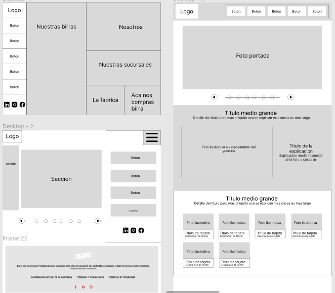

# Brewery cerveceria

## Indice
- [¿Que es Brewery?](#¿que-es-brewery)
- [Tecnologias y tecnicas de diseño utilizadas](#tecnologias-y-tecnicas-de-diseño-utilizadas)
- [Requisitos tecnicos](#reqisitos-tecnicos)
- [Requisitos de diseño]()

# ¿Que es Brewery?

**Brewery no existe**, es el concepto de una cerveceria que tiene mas de 300 años en el negocio cervecero y ha decidido digitalizar su imagen, compartiendo sus productos y reseñas con el mundo de internet.

Nuestro trabajo fue hacer una implementacion de lo que para nosotros es Brewery mediante un **sitio web estatico**, utilizando unicamente **HTML, CSS y JS**.

# Tecnologias y tecnicas de diseño utilizadas

La pagina fue previamente diseñada utilizando **Figma**, una herramienta que ayudo bastante para darnos una idea general y grupal de lo que queriamos para la pagina.

Hicimos un estudio previo de los sitios web de distintas cervecerias conocidas para darnos una idea de la forma, los colores y los patrones de diseño que utilizan.

## Maquetas de baja fidelidad

A partir de la investigacion previa creamos maquetas de baja fidelidad para poder comenzar a trabajar rapidamente en el codigo con una idea, asi evitamos programar como pollo sin cabeza y creamos de una vez algo que podamos usar. 

## Colores, iconos, imagenes

Si bien generamos varias paletas de colores utilizando imagenes representativas, tambien teniamos variedad y calidad para elegir, a la hora de tomar una desicion pudimos deducir que no servimos para elegir colores.

Algunos logos que utilizamos fueron creados a mano para poder tener un **.svg** mas controlado de este, teniamos la loca idea de hacer iconos animados, jugar un poco con transiciones y animaciones mas complejas para el logo, pero resulto que eran demaciado complejas y por falta de tiempo terminaron en ser algunos iconos y el logo innecesariamente detallados y complejos.

Tambien utilizamos algunos iconos de **fontawesome y flaticon**, esta seria la desicion final de colores e iconos para el sitio web.

## Tecnicas de diseño

Algunos conceptos de diseño fueron utilizados para dar un resultado mas vistoso y organizado en la pagina, ademas de una implementacion con una estructura mas robusta y escalable siguiendo los principios de **Atomic design**.

La pagina **no es Mobile first** y de hecho no es muy responsive, pero es lo justo y necesario.

Tecnicas como **Máscara de capa, Overlap y Sombreado** se utilizaron tanto en las imagenes como en el sitio en gneral, por ejemplo para la verificacion de edad.

Teniamos la intencion de darle una estructura al codigo **JS** aplicando **programacion orientada a objetos**, junto a esto crear un **router** para poder realizar **Partial render** utilizando javascript puro, sin frameworks ni cosas raras, pero dado que el codigo **JS** tan simple era complejizar la pagina de una forma innecesaria asi que se desestimo la propuesta.

# Reqisitos tecnicos

- Poseer al menos 4 páginas HTML, siendo su tematica libre.
> Las utilizadas fueron: index.html, sucursales.html, contacto.html, cervezas.html, nosotros.html
- Utilizar etiquetas semánticas para estructurar el sitio.
> Las clases utilizadas en los divs tambien siguen una estructura semantica, similar a la que utilizan algnos frameworks css como bootstrap
~~~ html
<header class="head-nav blur">
    
...
    

    <nav class="nav-bar">...
    </nav>
    
...
    

</header>

...

<main id="main" class="container blur">...
    <section class="pr_block-container">...
        <article class="pr_block-wrapper">...
        </article>
    </section>
    
...
        <article class="contenido">...
        </article>
    

</main>
~~~

- Contener un formulario de cotacto con validacion realizada mediante JS. Opcional: el formulario podrá enviar un mail utilizando algun servicio externo destinado para ello

> El formulario es validado tanto por HTML como por JS, ademas tiene un captcha que genera valores random

Validacion HTML mediante **required**
~~~ html
<form id="form-contacto" class="contact-form" action="https://formspree.io/f/xwkznrke" method="POST">
    

        <label>Nombres (*)</label>
        <input name="nombre" type="text" required>
    

~~~

Validacion JS
~~~ js
if(datos.nombre && datos.apellido && datos.email && datos.pais && datos.ciudad && datos.consulta && datos.resultado){
    if(datos.resultado == eval(cuenta)){
        let form = new FormData(formContacto);
        enviarMail(formContacto, form);
        formContacto.reset();
        msgError.innerHTML = "Gracias por contactarte con nosotros, contestaremos lo antes posible";
        msgError.classList.remove("message-error");
        msgError.classList.add("message-success");
    }
~~~

Servicio de Email exerno: Se puede observar en el action del form, utilizamos la **API de Formspree** para que nos llegue el submit del formulario a nuestro email.

- Utilizar al menos un Iframe, íconos de FontAwesome o Flaticon; y fuentes locales o bien de Google Fonts.

> Utilizamos todas estas cosas, el Iframe es el de Google Maps y esta en la seccion de sucursales.

- Tener al menos una pagina totalmente responsive con 3 puntos de corte para 3 tamaños de dispositivos distintos.

- Incorporar al menos una animacion, transformacion o una transicion.

- Poseer una estructura HTML maquetada con Flexbox y/o Grid.

- Consumir una API Rest desde JavaScript.

- El desarrollo web deberá subirse a un servidor on-line para poder ser navegada por el Docente.

